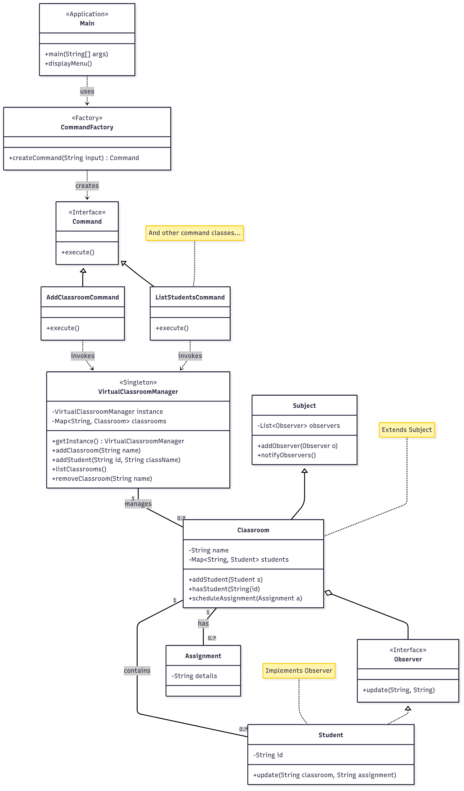

**Exercise 1: Problem Statement on Design patterns**
  
   **1.  Two use cases to demonstrate two behavioural design pattern.**
         
         COMMAND - Food Order System
         OBSERVER - Weather Station
   
   **2.  Two use cases to demonstrate two creational design pattern.**
      
         FACTORY METHOD - Pizza Factory
         SINGLETON - Print Spooler
  
   **3.  Two use cases to demonstrate two structural design pattern.**
      
         ADAPTER - UPI Payment
         PROXY - ATM
   
   **How to Run?**
         Change directory to Exercise_1 -> corresponding folders -> and then Compile each folders and run the file containing Main Method.

         javac *foldername.java  //javac *command.java
         java filename.java      //java CommandDemo.java
**Exercise 2: 8. Virtual Classroom Manager Programming Exercise**
  
  **1. Core Entities:**
        
        Classroom
        Student
        Assignment 
  
  **2. Design Patterns used and their respective classes:**
        
        Singleton Pattern - VirtualClassroomManager
        Factory Method - CommandFactory
        Command Pattern - AddClassroomCommand, AddStudentCommand, Command, HelpCommand, ListClassroomsCommand, ListStudentsCommand, RemoveClassroomCommand, 
                          ScheduleAssignmentCommand, SubmitAssignmentCommand
        Observer Pattern - Observer(interface) and Subject
  
  **3. Possible Operations:**
        
        Classroom Management - Add/list/remove classrooms
        Student Management - Add/list students
        Assignment - Scheduled assignment for a class, Allow Student Submissions

  **How to Run?**
         change directory to Exercise_2 -> virtual-classroom-manager -> and then
         
         Compile as:
           mvn clean install

         Execute as:
           mvn exec:java

         Output:
           Virtual Classroom Manager Initialized.

          --- Virtual Classroom Manager Menu ---
          Available Commands:
            add_classroom <class_name>              - Creates a new classroom.
            add_student <student_id> <class_name>       - Enrolls a student in a classroom.
            schedule_assignment <class_name> 
  - Schedules an assignment for a class.
            submit_assignment <student_id> <class_name> 
 - Submits an assignment.
            list_classrooms                           - Shows all created classrooms.
            list_students <class_name>                - Lists all students in a classroom.
            remove_classroom <class_name>             - Removes a classroom.
            help                                      - Shows this command menu.
            exit                                      - Shuts down the application.
          ----------------------------------------
          Enter commands or type 'exit' to quit.
          >

 
