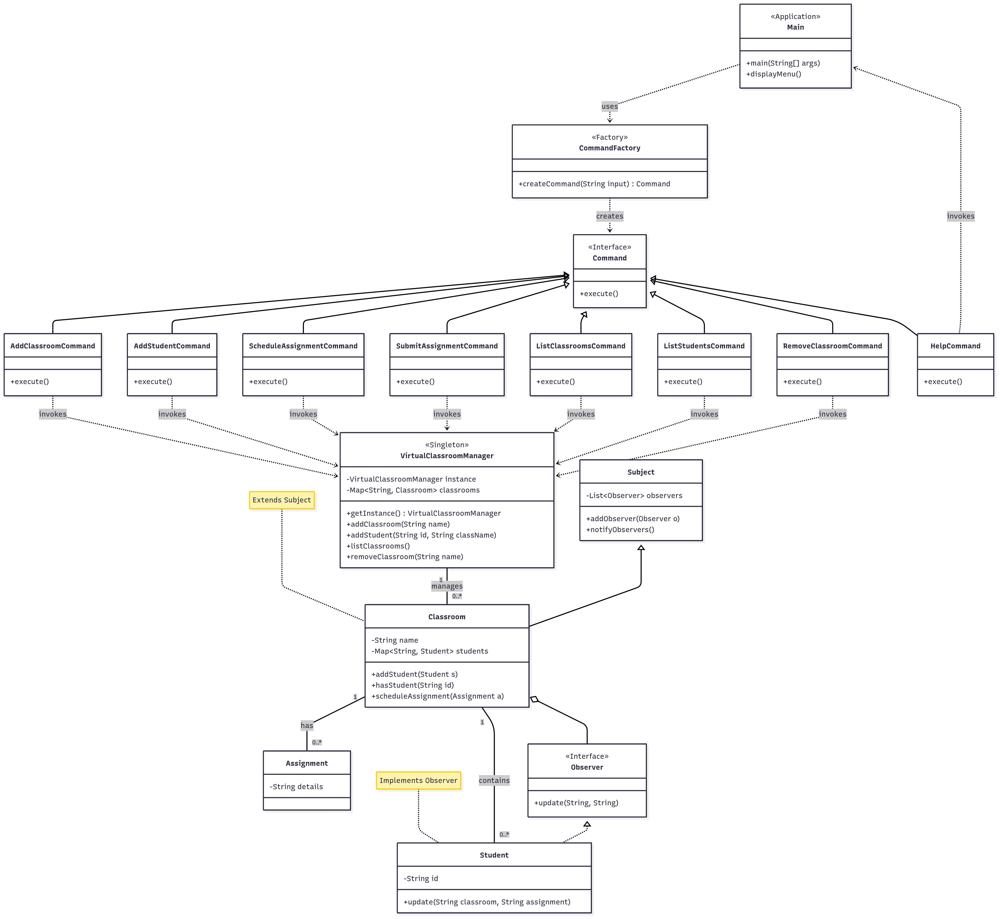

# Java Design Patterns and Application Exercises

This repository contains two main exercises. The first demonstrates six fundamental design patterns with simple, focused examples. The second is a complete, terminal-based Virtual Classroom Manager application that integrates multiple patterns and follows SOLID principles.

---

  ## Exercise 1: Design Pattern Demonstrations

  This exercise showcases the implementation of six fundamental design patterns, grouped by their category.

  ### Behavioral Patterns
  * **Command Pattern:** A food ordering system.
  *  **Observer Pattern:** A weather station notification system.

  ### Creational Patterns
  * **Factory Method:** A pizza factory for creating different pizza types.
  * **Singleton Pattern:** A print spooler ensuring only one instance.

  ### Structural Patterns
  * **Adapter Pattern:** A UPI payment adapter for various payment gateways.
  * **Proxy Pattern:** An ATM proxy for controlling access to a bank account.

  ### How to Run
  Navigate into the corresponding sub-directory within `Exercise_1/`. Compile all `.java` files and then run the main demo file.

  ```bash
  # Example for the Command pattern folder
  cd Exercise_1/behavioural/command

  # Compile all java files in the folder
  javac *.java

  # Run the main demo class
  java CommandDemo
  ```

---

# EXERCISE 2: 8. Virtual Classroom Manager Programming Exercise 

### Overview
This is a terminal-based Virtual Classroom Manager built in Java. It provides core functionality for managing classrooms, students, and assignments through a simple command-line interface, built upon models that manage the relationships between classrooms, their students, and scheduled assignments.

### Features

* **Classroom Management:** Add, list, and remove classrooms.
* **Student Management:** Add and list students in a specific classroom.
* **Assignment Management:** Schedule assignments for a class and allow student submissions.

### Design Patterns Used
* **Singleton Pattern:** `VirtualClassroomManager`
* **Factory Method:** `CommandFactory`
* **Observer Pattern:** `Observer` (interface) and `Subject`
* **Command Pattern:**
    * `AddClassroomCommand`
    * `AddStudentCommand`
    * `ScheduleAssignmentCommand`
    * `SubmitAssignmentCommand`
    * `ListClassroomsCommand`
    * `ListStudentsCommand`
    * `RemoveClassroomCommand`
    * `HelpCommand`

### SOLID Principles

The project was designed with the SOLID principles in mind to ensure the code is robust, maintainable, and scalable.

* **Single Responsibility Principle (SRP):** Each class has one specific job. The `CommandFactory` only creates commands, the `VirtualClassroomManager` only manages the application's state, and each command class (e.g., `AddStudentCommand`) is responsible for only one action.

* **Open/Closed Principle (OCP):** The system is open to extension but closed for modification. To add a new feature, like `remove_student`, we can create a new `RemoveStudentCommand` class and update the factory without changing any existing command classes.

* **Liskov Substitution Principle (LSP):** Any concrete command object (like `AddClassroomCommand`) can be substituted for the `Command` interface without breaking the application. The `main` method operates on the `Command` interface, regardless of the specific command being executed.

* **Interface Segregation Principle (ISP):** The interfaces are small and focused. The `Command` interface has only one method (`execute`), and the `Observer` interface has only one method (`update`), ensuring that classes are not forced to implement methods they don't need.

* **Dependency Inversion Principle (DIP):** High-level components depend on abstractions, not on low-level details. The `Main` class depends on the `Command` interface (abstraction), not on the concrete command classes (details).

### Compilation and Execution
1. **Navigate to the project directory:(Exercise_2 -> virtual-classroom-manager)**
    ```bash
    cd virtual-classroom-manager
    ```

3.  **Compile and Build the Project:**
    ```bash
    mvn clean install
    ```

4.  **Execute the Application:**
    ```bash
    mvn exec:java
    ```
    
## Sample Interaction
           Virtual Classroom Manager Initialized.

          --- Virtual Classroom Manager Menu ---
          Available Commands:
            add_classroom <class_name>              - Creates a new classroom.
            add_student <student_id> <class_name>       - Enrolls a student in a classroom.
            schedule_assignment <class_name> <details>  - Schedules an assignment for a class.
            submit_assignment <student_id> <class_name> <details> - Submits an assignment.
            list_classrooms                           - Shows all created classrooms.
            list_students <class_name>                - Lists all students in a classroom.
            remove_classroom <class_name>             - Removes a classroom.
            help                                      - Shows this command menu.
            exit                                      - Shuts down the application.
          ----------------------------------------
          Enter commands or type 'exit' to quit.
          >

## CLASS DIAGRAM FOR VIRTUAL CLASSROOM MANAGER
 
